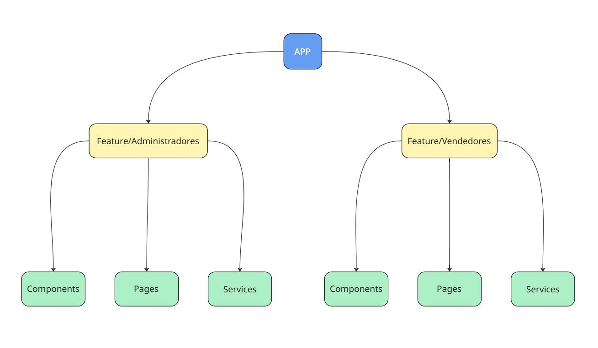

# Leadflow — Frontend

---

# Leadflow — Frontend

SPA em **React + TypeScript (Vite)** para o Leadflow: gerenciamento de vendedores (cadastro, inativação e segmentação) e autenticação (JWT)

---

## Visão Geral

O frontend do **Leadflow** oferece a UI para:

- Cadastro de vendedores
- Deleção de vendedores
- Inativação de vendedores
- Configuração de segmentação dos vendedores

Imagens:

- Diagrama de features: `docs/arquitetura.jpg`

---

## Arquitetura & Organização

**Estilo:** *Feature-based* (organização por domínio).
Principais domínios: **Vendedor** e **Administrador**.

> Dica visual rápida:
> 



**Diretrizes:**

- Cada feature contém páginas, componentes próprios, hooks e serviços de API.

---

## Infra & Segurança

- **Hospedagem:** Render
- **Autenticação:** JWT (cookies HttpOnly)  + API Key.

---

## Tecnologias Principais

- **React 18+, TypeScript, Vite**
- **Axios** para chamadas HTTP
- **react-router-dom** para roteamento

> A lista completa está no package.json.
> 

---

## Como Rodar Localmente

### Pré-requisitos

- Node 18+ (LTS 20 recomendado)
- pnpm **ou** npm **ou** yarn
- API rodando em `http://localhost:8080` (ou ajuste `VITE_API_BASE_URL`)

### Variáveis de ambiente (`.env.local`)

```bash
VITE_API_BASE_URL=http://localhost:8080
```

### Instalação

```bash
pnpm install
# ou npm ci / yarn

```

### Dev server

```bash
pnpm dev
# http://localhost:517
```

### Build & Preview

```bash
pnpm build
pnpm preview

```

---

## Estrutura de Pastas

```
src/
  app/                # bootstrap da aplicação (providers, rotas)
  features/
    orcamentos/       # páginas, componentes e hooks do domínio
    usuarios/
  utils/              # axios instance, interceptors, clients por feature
  models/         
assets/
docs/

```

> Ajuste os nomes conforme seu repo real.
> 

---

## Scripts Úteis

```bash
pnpm dev         # desenvolvimento
pnpm build       # build de produção (dist/)
pnpm preview     # serve o build localmente
pnpm lint        # ESLint
pnpm test        # Vitest/Jest (se configurado)
pnpm format      # Prettier (se configurado)

```

---

## Padrões de Código & Qualidade

- **ESLint + Prettier** (padronização e formatação)
- **Acessibilidade**: use atributos semânticos/ARIA, navegação por teclado e contraste adequado.

---

## Ambientes & Deploy

- **Local:** Vite Dev Server (`pnpm dev`)
- **Variáveis de ambiente no deploy:** `VITE_API_BASE_URL`, chaves OAuth, etc.

---

## Licença / Uso

Este repositório é **proprietário** e destinado a uso interno do Cotalizer.

Não é liberado para uso, cópia, modificação ou distribuição por terceiros sem autorização expressa.

*Copyright (c) 2025 Cotalizer. Todos os direitos reservados*